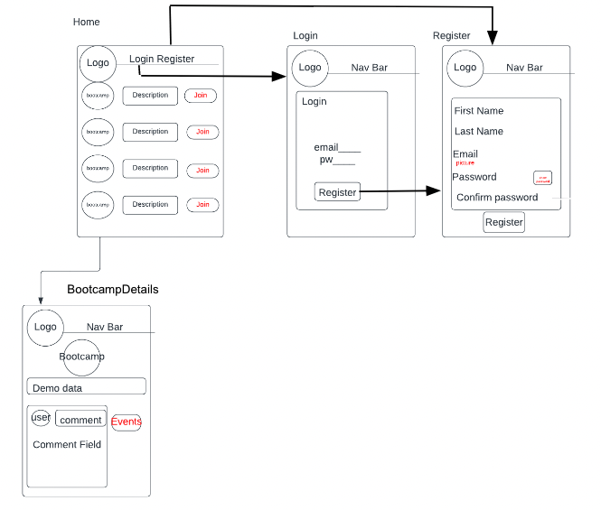
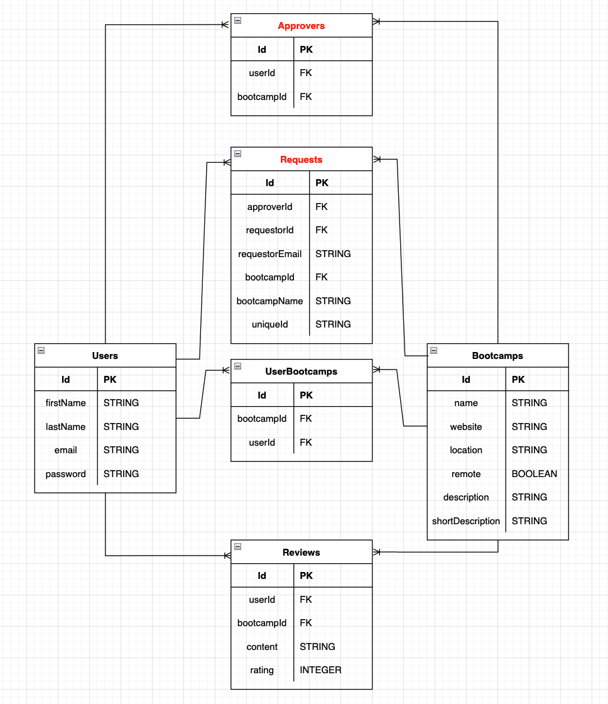

# Bootcamp-Buddy-Backend
## Date 11/18/22
### By: [Bret Borden](https://www.linkedin.com/in/bret-borden/), [Fredy Laksmono](https://www.linkedin.com/in/fredy-laksmono/), [LaShelle Rauseo](https://www.linkedin.com/in/lashelle-rauseo/), [Paige Layman](https://www.linkedin.com/in/paige-layman/)

#### [Github Bret](https://github.com/bordencodes) | [Github Fredy](https://github.com/fredy-laksmono) | [Github LaShelle](https://github.com/lnicole3) | [Github Paige](https://github.com/paigelayman)
#### [Project Trello](https://trello.com/b/huDaSEtw/bootcamp-buddy)

---

[App](https://bootcamp-buddy-app.herokuapp.com/) | [Front-end GitHub](https://github.com/paigelayman/bootcamp-buddy-frontend) | [Back-end GitHub](https://github.com/fredy-laksmono/bootcamp-buddy-backend)

---

### Description
   
"Bootcamp Buddy is a tool for Software Engineers across the globe. Users are just one click away from getting basic information about any bootcamp, as well as read the personal reviews of attendees. Browse as a guest, or get involved by creating an account and placing a review for any bootcamp you have attended!"

***

### Technologies used

* HTML
* CSS
* PostgreSQL
* Sequelize
* Express
* React
* Node js

***

### Getting Started
[Bootcamp-Buddy-App](https://bootcamp-buddy-fl.herokuapp.com/)   
When you open the app you are able to view all bootcamps in the database.  

Click on any Bootcamp to get access to the details page, where you get information about that specific bootcamp, as well as read and create reviews.
You can register with your first name, last name, e-mail, in order to create a review. You are only able to create one review per bootcamp, however, you can edit and delete your comment.

***

### Photos

***

### Credits

PostgreSQL: [https://www.postgresql.org]   
Sequelize: [https://sequelize.org/]  
Express: [https://expressjs.com/]   
React:[https://reactjs.org/]   
NodeJs: [https://nodejs.org/en/]   
Canva: [https://www.canva.com/]   
W3 Schools: [https://www.w3schools.com/]   
Coolers: [https://coolors.co/]   