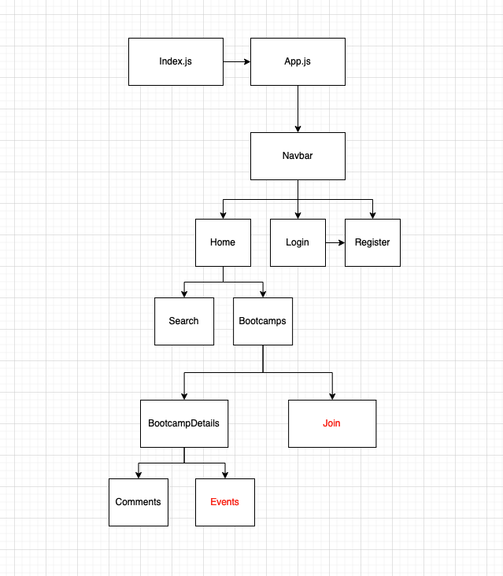

# Bootcamp-Buddy-Backend
## Date 11/10/22
### By: Bret Borden. Fredy Laksmono, LaShelle Rauseo and Paige Layman

#### [Github Bret](https://github.com/bordencodes) | [Github Fredy](https://github.com/fredy-laksmono) | [Github LaShelle](https://github.com/lnicole3) | [Github Paige](https://github.com/paigelayman)
#### [Project Trello](https://trello.com/b/huDaSEtw/bootcamp-buddy)
***

### Description
Provide a social place for people who want to connect and share their experience and knowledge about Bootcamp they have/will take. Prospective student can use the info to help guide their decision which Bootcamp best fit for them.

***

### Technologies used

* HTML
* CSS
* PostgreSQL
* Sequelize
* Express
* React
* Node js

***

### Getting Started
1. Visit our app. Link will be provided when it's published.
2. Select any bootcamp you are interested to view.
3. In order to join/post, you need to have an account. Click Login/Register at the top based on what you need.
4. Once you're signed in, you can join Bootcamp and start posting on the Bootcamp you joined.

***

### Photos

***

### Credits

PostgreSQL: [https://www.postgresql.org]   
Sequelize: [https://sequelize.org/]  
Express: [https://expressjs.com/]   
React:[https://reactjs.org/]   
NodeJs: [https://nodejs.org/en/]